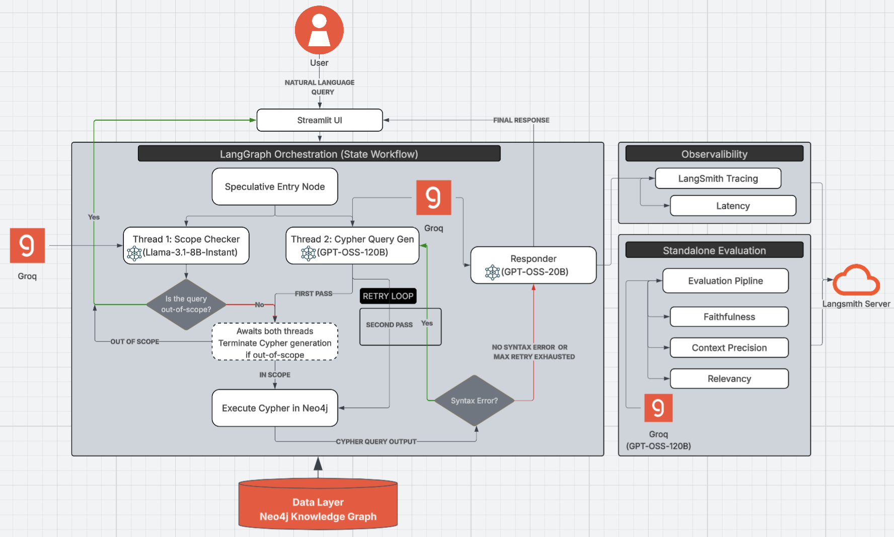

# 🛢️ Geopolitical Oil Trade and Risks Intelligence Platform

An advanced **GraphRAG (Graph Retrieval-Augmented Generation)** application designed for low latency and high precision. This platform allows users to query complex global crude oil trade data, calculate geopolitical import and export risks, and analyze oil trade using natural language.

Powered by a tiered multi-agent architecture via **LangGraph**, it translates user queries into Cypher queries which run directly on a **Neo4j** knowledge graph, eliminating standard vector-search hallucinations.

---
## System Architecture

---
## ✨ Key Features

- **Multi-Thread Execution** The pipeline routes user queries concurrently to an 8B Scope checker and a 120B Cypher query generator, drastically reducing Time-To-First-Token (TTFT) while maintaining strict scope control.
- **Multi-Tier LLM Stack for Optimized Performance:**
  - **Scope Checker (Llama-3.1-8B-Instant):** Blazing-fast scope classification and guardrail enforcement.
  - **Cypher Query Generator (GPT-OSS-120B):** High-intelligence context extraction and Neo4j Cypher generation.
  - **Responder (GPT-OSS-20B):** Natural language translation of database outputs.
- **Self-Healing Retry Loop:** Automatically catches Cypher syntax errors and feeds them back to the 120B model for real-time correction (Max Retry is 1).
- **Offline Evaluation:** Automated offline benchmarking via **RAGAS** (Faithfulness, Context Precision, Relevancy) and online telemetries like latency via **LangSmith**.

---